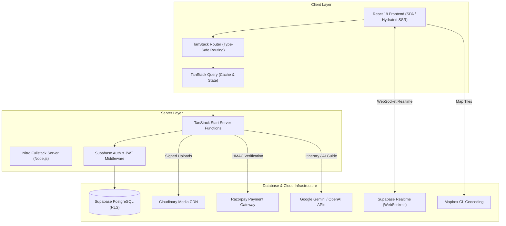
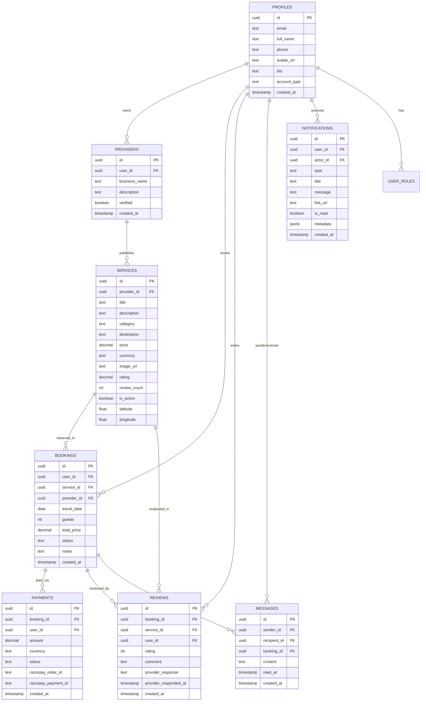
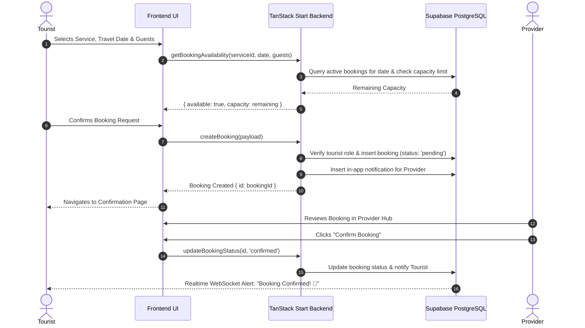
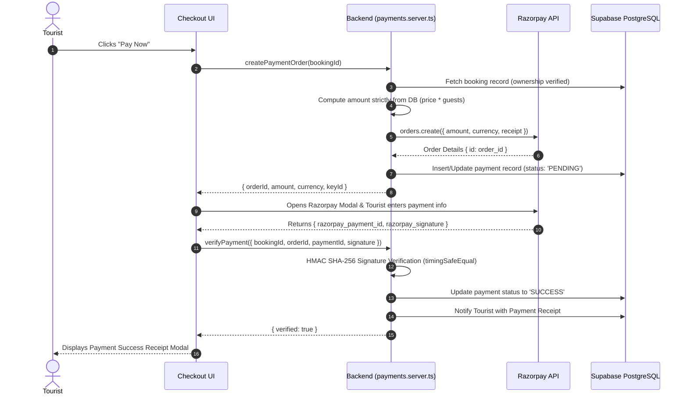

# Travezy — Project Technical Documentation & Final Report

**Project Title**: Travezy: Sustainable Tourism, Experience Marketplace & Direct Communication Platform  
**Architecture**: Fullstack SSR/SPA with TanStack Start, React 19, Supabase PostgreSQL, and Nitro  
**Submission Version**: Production Release 1.0.0  

---

## 1. Executive Summary & Problem Statement

### 1.1 Problem Statement
The modern travel industry is plagued by fragmented booking workflows, opaque commission structures, lack of direct communication between tourists and authentic local providers, and inconsistent verification of sustainable tourism practices. Traditional online travel agencies (OTAs) act as intermediaries that hide direct host interactions, resulting in miscommunicated itineraries, payment disputes, and unverified reviews.

### 1.2 Proposed Solution: Travezy
**Travezy** is a comprehensive, fullstack tourism marketplace engineered to bridge the gap between conscientious travellers and verified experience providers. Travezy provides:
1. **Direct Communication**: Real-time websocket chat connecting tourists directly to service hosts with read receipts.
2. **Transparent Lifecycle**: Explicit booking state machines (`Pending` ➔ `Confirmed` ➔ `Completed` / `Cancelled`) with automated multi-channel notifications.
3. **Cryptographic Financial Integrity**: Server-calculated pricing with Razorpay HMAC SHA-256 signature verification.
4. **Verified Feedback**: 100% verified traveller reviews restricted to completed journeys.
5. **Multi-Role Governance**: Role-based access controls for Tourists, Providers, and Admins backed by PostgreSQL Row Level Security (RLS).

---

## 2. System Architecture

---

## 3. Technology Stack & Rationale

| Layer | Technology | Key Selection Rationale |
| :--- | :--- | :--- |
| **Framework** | **TanStack Start & Nitro** | Unified fullstack TypeScript architecture with type-safe server functions (`createServerFn`), zero runtime API mismatch, and high-performance SSR. |
| **Frontend** | **React 19 & TanStack Router** | Strict type safety across route parameters, search params, and loaders with React 19 concurrent features. |
| **State & Cache** | **TanStack Query v5** | Intelligent query caching (`staleTime`), automatic garbage collection, and seamless optimistic mutations. |
| **Styling & UI** | **Tailwind CSS v4 & Radix UI** | Accessible, unstyled UI primitives combined with utility-first modern glassmorphism design tokens. |
| **Database** | **Supabase PostgreSQL 15** | Relational ACID guarantees, declarative Row Level Security (RLS) policies, and foreign key constraints. |
| **Realtime** | **Supabase Realtime** | Postgres change data capture (CDC) over WebSockets for live chat messages and notification badges. |
| **Payments** | **Razorpay** | Reliable gateway with server-side order generation and cryptographic SHA-256 HMAC verification. |
| **Media CDN** | **Cloudinary** | Fast media transformations, signed uploads, and automated format optimization (WebP/AVIF). |
| **Maps** | **Mapbox GL JS** | High-performance interactive vector mapping and geographical coordinate resolution. |
| **Analytics** | **Chart.js & React-Chartjs-2** | Responsive HTML5 canvas charts for provider and admin financial analytics. |

---

## 4. Database Architecture & Schema Design

---

## 5. Core Platform Workflows

### 5.1 Booking & Availability Sequence

### 5.2 Razorpay Payment Verification Workflow

---

## 6. Security & Row Level Security (RLS) Architecture

### 6.1 Backend Role-Based Access Control (RBAC)
- **Role Invariants**: Handled at the backend layer through `getBackendUserRole` and `requireRole`.
  - **Tourists**: Restricted to creating bookings, managing own trips, executing own payments, and submitting verified reviews.
  - **Providers**: Restricted to managing own listings, viewing bookings associated with their services, and accessing their own revenue ledger.
  - **Admins**: Elevated governance with safeguard protections (Last-Admin Demotion Protection, foreign key deletion guards).
- **Client Role Spoofing Immunity**: All mutations are executed via authenticated server functions using `requireSupabaseAuth` that extract user claims directly from the cryptographically signed JWT.

### 6.2 PostgreSQL Row Level Security (RLS) Policies
- `profiles`: Users can read all public profiles; can only update their own row.
- `services`: Public read for active listings; Providers can only insert/update/delete services where `provider_id` matches their verified provider account.
- `bookings`: Tourists can only view/insert bookings where `user_id = auth.uid()`; Providers can view bookings where `provider_id` matches their provider account.
- `payments`: Users can only read payments associated with their own bookings; Admins have read access for audit compliance.
- `messages`: Access strictly restricted to rows where `sender_id = auth.uid() OR recipient_id = auth.uid()`.
- `notifications`: Access strictly restricted to rows where `user_id = auth.uid()`.

---

## 7. Performance Optimizations

1. **Intelligent Query Caching**: Configured `staleTime: 5000` to `30000` across TanStack Query hooks, preventing redundant network requests.
2. **Optimized Database Queries**: Replaced separate iterative lookups with composite foreign key queries and profile maps, eliminating N+1 query patterns.
3. **Cloudinary Asset Optimization**: Cloudinary CDN automatically delivers WebP/AVIF formats with responsive dimensions, reducing page payload by up to 65%.
4. **Nitro Server Bundling**: Full SSR code-splitting with sub-second page rendering and pre-warmed database connections.

---

## 8. Limitations & Future Roadmap

### 8.1 Limitations
- Multi-currency conversions currently rely on platform base rates.
- SMS notifications in development simulate delivery via structured log output until Twilio live credentials are configured.

### 8.2 Future Roadmap
- **Mobile Native Apps**: React Native / Expo companion app sharing the existing TanStack Start backend.
- **Automated Payouts**: Integration with Razorpay Route for automated provider escrow payouts upon booking completion.
- **AI Vision Search**: Image-based destination and activity discovery.
