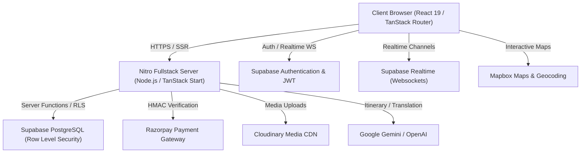

# 🌍 Travezy — Sustainable Tourism & Curated Experiences Platform

[](https://render.com)
[](https://www.typescriptlang.org/)
[](https://react.dev/)
[](https://tanstack.com/start)
[](https://supabase.com)
[](https://razorpay.com)
[](https://cloudinary.com)
[](https://mapbox.com)

**Travezy** is an enterprise-grade, fullstack sustainable tourism platform connecting travellers with certified eco-tourism providers, local guides, boutique stays, and authentic cultural experiences.

Built with **TanStack Start**, **React 19**, **Supabase PostgreSQL (RLS)**, and **Nitro**, Travezy features role-based access control, real-time messaging, dynamic capacity scheduling, cryptographically verified Razorpay payments, interactive Mapbox geolocation, in-app notifications, and AI-powered travel tools.

---

## 🚀 Key Highlights & Features

### 🧳 1. Tourist Experience
- **Search & Discovery**: Multi-filter catalog (Category, Destination, Price range, Star rating).
- **Interactive Map Exploration**: Geolocation coordinates with interactive Mapbox pins.
- **Smart Booking & Scheduling**: Date-based guest capacity validation with instant availability checks.
- **Razorpay Payments**: Secure checkout with HMAC SHA-256 signature verification and printable receipts.
- **My Trips Dashboard**: Track upcoming journeys, past trips, payment status, and booking lifecycle.
- **Verified Reviews**: 100% verified guest ratings with breakdown distributions.
- **Direct Host Chat**: Real-time messaging with travel providers and host response view.
- **AI Travel Assistant & Translator**: Generative itinerary planning, travel advice, and multi-language translation.

### 🏢 2. Provider Hub
- **Provider Analytics Dashboard**: Live metrics for active listings, total reservations, and revenue.
- **Revenue Reports with Chart.js**: Monthly and yearly gross settlement graphs.
- **Listing Management**: Create, edit, and publish experiences with Cloudinary drag-and-drop uploads and Mapbox location picker.
- **Booking Management**: Real-time reservation status transitions (`Pending` ➔ `Confirmed` ➔ `Completed` / `Cancelled`).
- **Guest Communication**: Split-pane chat panel and contextual in-modal guest chat.
- **Review Moderation**: Monitor customer feedback and publish official host responses.

### 🛡️ 3. Admin Governance & Telemetry
- **Platform Telemetry Overview**: Gross Booking Value (GBV), platform user counts, listing metrics, and real-time transaction stream.
- **User & Role Administration**: Audit users, manage permissions (Tourist / Provider / Admin), with automated **Last-Admin Safeguards**.
- **Provider Verification**: Partner compliance and verified badge management.
- **Listing & Review Moderation**: Moderate marketplace listings with foreign key safeguards.
- **Financial Ledger**: Audit payment gateway references without exposing private PANs or credentials.

### 🔔 4. Real-time Communication & Notifications
- **In-App Notification Bell**: Live unread badge with Supabase Realtime websocket subscriptions.
- **Multi-Channel Dispatcher**: Transactional Email (Resend) and SMS (Twilio) support with graceful development fallback.
- **Lifecycle Alerts**: Automatic triggers on booking creation, status changes, payments, reviews, and new messages.

---

## 🏗️ System Architecture



---

## 💻 Tech Stack

| Domain | Technology |
| :--- | :--- |
| **Framework** | [TanStack Start](https://tanstack.com/start) (Fullstack SSR/SPA) + [Nitro](https://nitro.unjs.io/) |
| **Frontend** | [React 19](https://react.dev/), [TanStack Router](https://tanstack.com/router), [TanStack Query](https://tanstack.com/query) |
| **Styling & UI** | [Tailwind CSS v4](https://tailwindcss.com/), [Radix UI](https://www.radix-ui.com/), [Lucide React](https://lucide.dev/), [Sonner](https://sonner.emilkowal.ski/) |
| **Database & Auth** | [Supabase](https://supabase.com/) (PostgreSQL 15 with Row Level Security & Realtime) |
| **Payments** | [Razorpay](https://razorpay.com/) (HMAC SHA-256 Signature Verification) |
| **Media CDN** | [Cloudinary](https://cloudinary.com/) (Signed / Unsigned Uploads & Transformations) |
| **Maps & Location** | [Mapbox GL JS](https://www.mapbox.com/) |
| **Analytics** | [Chart.js](https://www.chartjs.org/) + [react-chartjs-2](https://react-chartjs-2.js.org/) |
| **Validation** | [Zod](https://zod.dev/) |

---

## 🛠️ Quickstart & Local Development

### 1. Prerequisites
- **Node.js**: v20.x or v22.x
- **npm** or **bun**

### 2. Installation
```bash
# Clone repository
git clone https://github.com/your-username/travezy.git
cd travezy

# Install dependencies
npm install
```

### 3. Environment Setup
Copy the example environment template and configure your keys:
```bash
cp .env.example .env
```
*(Refer to [`.env.example`](file:///c:/Users/likit/Desktop/travezyy/supabase-hub-06-main/.env.example) for variable definitions).*

### 4. Start Development Server
```bash
npm run dev
```
Open [http://localhost:3000](http://localhost:3000) in your browser.

---

## 🚀 Production Deployment (Render)

Travezy is pre-configured for automated deployment on **Render** using [`render.yaml`](file:///c:/Users/likit/Desktop/travezyy/supabase-hub-06-main/render.yaml):

1. **Build Command**:
   ```bash
   npm install && npm run build
   ```
2. **Start Command**:
   ```bash
   npm run start # Runs: node .output/server/index.mjs
   ```

For detailed deployment instructions, Supabase auth redirects, Cloudinary upload presets, and Razorpay webhook setups, see **[DEPLOYMENT.md](file:///c:/Users/likit/Desktop/travezyy/supabase-hub-06-main/DEPLOYMENT.md)**.

---

## 🧪 Testing Suite

Travezy includes a comprehensive automated test suite covering all modules:

```bash
# Run all automated test suites
node test-week9-full-suite.mjs
node test-final-security-and-e2e.mjs
node test-communication-system.mjs
node test-week7-part1-dashboards.mjs
node test-week7-part2-admin.mjs
```

### Test Coverage Summary:
- **74 / 74 Automated Tests Passed (100%)**
- Complete testing matrix available in **[TESTING_REPORT.md](file:///c:/Users/likit/Desktop/travezyy/supabase-hub-06-main/TESTING_REPORT.md)**.

---

## 📖 Detailed Project Documentation & Demo Guide

- **Technical Report**: [PROJECT_DOCUMENTATION.md](file:///c:/Users/likit/Desktop/travezyy/supabase-hub-06-main/PROJECT_DOCUMENTATION.md)
- **Testing Summary Matrix**: [TESTING_REPORT.md](file:///c:/Users/likit/Desktop/travezyy/supabase-hub-06-main/TESTING_REPORT.md)
- **Evaluation Demo Script**: [DEMO_GUIDE.md](file:///c:/Users/likit/Desktop/travezyy/supabase-hub-06-main/DEMO_GUIDE.md)
- **Render Deployment Guide**: [DEPLOYMENT.md](file:///c:/Users/likit/Desktop/travezyy/supabase-hub-06-main/DEPLOYMENT.md)

---

## 📄 License
This project is licensed under the MIT License.
